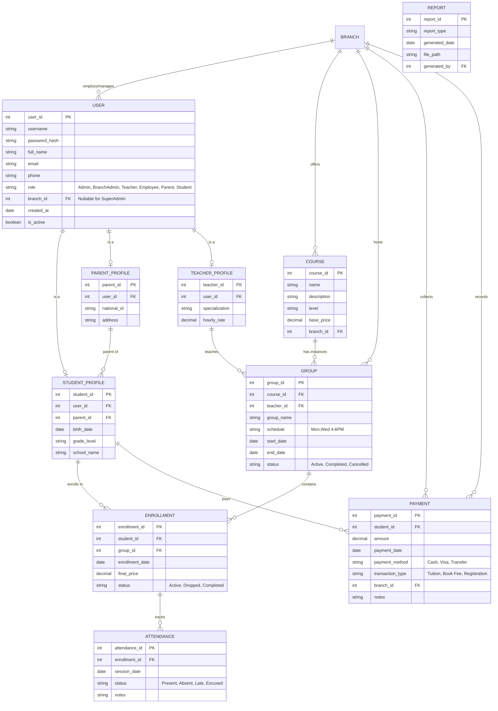

# ER Diagram - EduMaster Pro
**المرحلة:** 2 (التحليل وتصميم قاعدة البيانات)
**التاريخ:** 2026-02-11

---

## المخطط الكياني العلائقي (Entity-Relationship Diagram)

Below is a textual representation of the Entities and their Relationships using Mermaid syntax, visualized for clarity.

---

## تفاصيل الجداول (Table Details)

### 1. `users` (Central Auth & Basic Info)
- **الغرض:** تخزين بيانات الدخول الأساسية لجميع المستخدمين لتسهيل عملية الـ Authentication.
- **الأعمدة:** `user_id`, `username`, `password_hash`, `full_name`, `email`, `phone`, `role`, `branch_id`, `is_active`.

### 2. `branches`
- **الغرض:** تخزين بيانات الفروع الـ 8 (أو أكثر مستقبلاً).
- **الأعمدة:** `branch_id`, `name`, `location`, `manager_name`, `contact_phone`.

### 3. `student_profiles` & `parent_profiles` & `teacher_profiles`
- **الغرض:** تمديد جدول المستخدمين ببيانات خاصة بكل دور (Normalization).
- **العلاقة:** One-to-One مع جدول `users`.

### 4. `courses` & `groups`
- **الغرض:** إدارة المحتوى التعليمي. الكورس هو المادة العلمية (مثل: انجليزي مستوى 1)، والمجموعة هي الفصل الدراسي الفعلي (Group A - السبت والاثنين).
- **الأعمدة:** `course_id`, `name`, `price` | `group_id`, `schedule`, `start_date`.

### 5. `enrollments`
- **الغرض:** ربط الطالب بالمجموعة (Enrollment).
- **الأعمدة:** `enrollment_id`, `student_id`, `group_id`, `status`.

### 6. `attendance`
- **الغرض:** تسجيل الحضور لكل طالب في كل حصة.
- **الأعمدة:** `attendance_id`, `enrollment_id`, `date`, `status` (Present/Absent).

### 7. `payments`
- **الغرض:** تتبع المعاملات المالية.
- **الأعمدة:** `payment_id`, `student_id`, `amount`, `date`, `type`.
